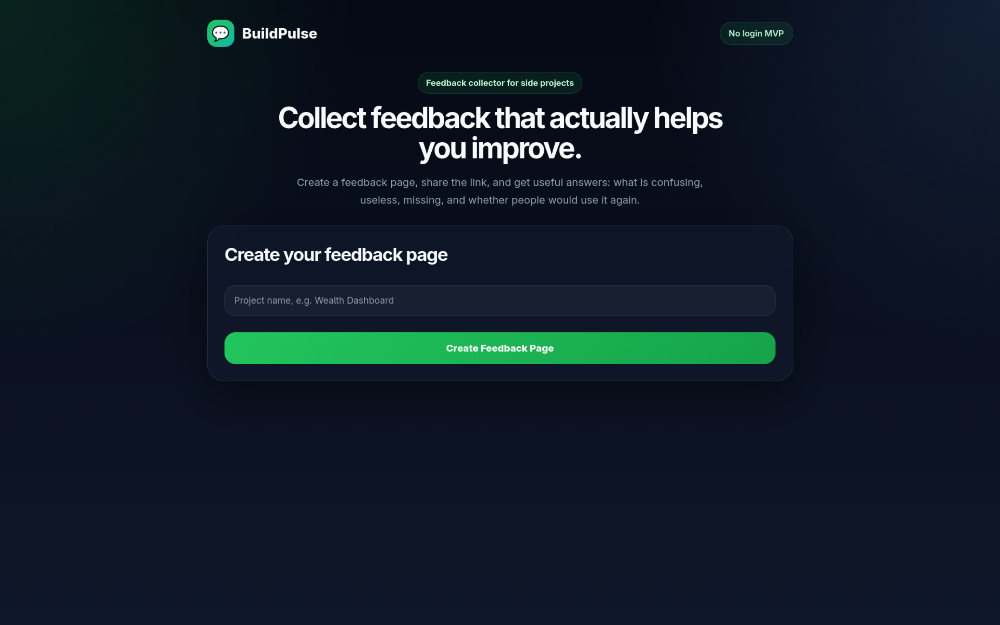
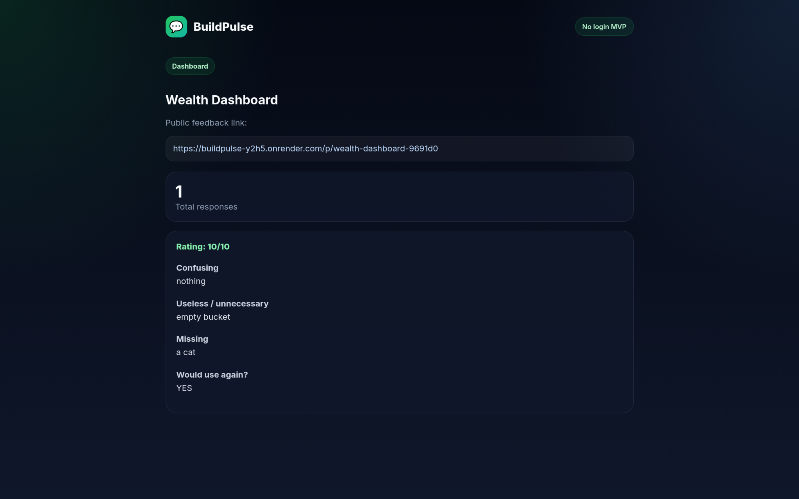

# BuildPulse

A simple no-login feedback collector for side projects.

## Live App

https://buildpulse-y2h5.onrender.com

## Screenshots

### Homepage

### Feedback Dashboard

## What it does

BuildPulse lets makers create a feedback page for their project, share the public link, and collect structured feedback in a private dashboard.

It is designed for early-stage builders who need honest feedback on what is confusing, useless, missing, or actually valuable.

## Features

- Create a feedback page for any project
- Public feedback form
- Private dashboard link
- Collect usefulness rating
- Ask structured feedback questions
- View submitted feedback
- No login MVP
- SQLite database
- Mobile-friendly UI

## Example Use Case

I use BuildPulse to collect feedback for my other project, Wealth Dashboard.

Flow:

1. User opens Wealth Dashboard
2. User clicks **Leave feedback**
3. User submits feedback through BuildPulse
4. Feedback appears in my private BuildPulse dashboard

## Tech Stack

- Python
- Flask
- PostgreSQL
- psycopg2
- HTML/CSS
- Render
- GitHub

## Status

Early MVP. Uses PostgreSQL for persistent feedback storage.

## Future Ideas

- Real user accounts
- Better dashboard analytics
- Export feedback to CSV
- Email notifications
- Multiple projects per user
- Public/private project settings
